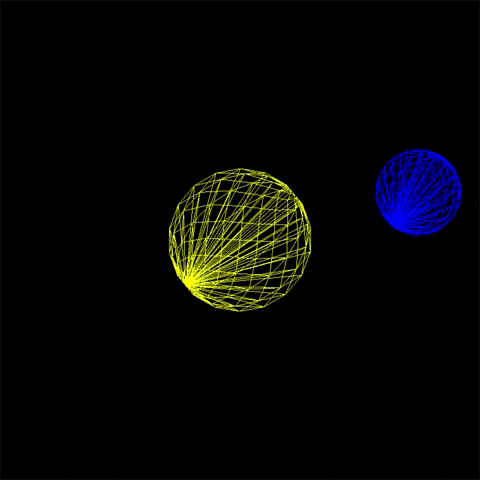

## Sphere

This program is to drawing and animating the spheres.

#### Dependencies
- Program should run in `win32` environment and needs `glut` and `opengl` libraries. Requires OpenGL version 3.1 and later. Program has been written with shaders(`glsl`) in modern OpenGL.

#### Program Modes:

**1.** A planet object (a sphere) is revolving around the sun
(another sphere) in a circular orbit where spheres are wireframes.The sun is stationary, but the planet moves around the sun. The planet also rotates around its own axis.

#### WARNING ####

If you get error like "illegal non-ASCII character" from glsl files, change vshader.glsl and fshader.glsl file endings from crlf to lf, and then run the program again.

#### Yaşar Can Kakdaş
